# How to use Earth Index, an AI tool for finding leads in satellite imagery

**[Earth Index](https://app.earthindex.ai/)** is a free AI-powered satellite imagery exploration tool created by **[Earth Genome](https://www.earthgenome.org/)**. It lets you mark visual examples and search for similar patterns across large areas. It runs on **Sentinel-2** and it very useful to solve “find a needle in a haystack” problems or map hard-to-map features such as mining, deforestation, land-use changes, and much more. You can learn more about it [here](https://www.earthgenome.org/earth-index#about).

## Use cases and stories

- **[Kamenolomi koji lome sve pred sobom / Quarries that crush everything in front of them](https://www.slobodnaevropa.org/a/zapadni-balkan-kamenolomi/33351974.html)**
- **[The Airstrips of Destruction](https://pulitzercenter.org/stories/airstrips-destruction)**
- **[Illegal Mining Set Up Air Bases in the Jungle](https://pulitzercenter.org/stories/illegal-mining-set-air-bases-jungle-spanish)**
- **[In Ghana, the environment and journalists are the first casualties of the illegal gold rush](https://forbiddenstories.org/ghana-the-trail-of-illegal-gold-leads-to-india/)**
- **[Appetite for wood: disappearing forests of Albania](https://www.balcanicaucaso.org/en/cp_article/appetite-for-wood-disappearing-forests-of-albania/)**

## Before you start

- Go to **[https://app.earthindex.ai](https://app.earthindex.ai)** and **create an account** using the same email address you used to pre-register for the workshop.
- If you haven't pre-registered, you still can create an account for free, but won't have access to all of EI's features. Feel free to contact me later and I'll help you get full access :)

## Starting a new a project

1. Click **Start a new project**.
2. Give it a name and, if you want, a description.
3. Click **Define Area of Interest** to choose the area we will work on. 
4. Draw an area around England. As a reference, use a box that covers southern and western England through the east coast, with the northern limit near Leeds.
5. In **Time Period** choose the year **2025**.
6. If everything looks good, confirm with **Create project**.

## Earth Index interface

### Labels panel

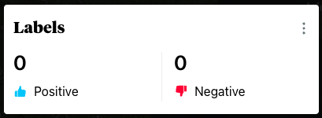

- Shows how many **positive** and **negative** labels you have marked.
- From the three-dot menu, you can export results or delete all labels at once.

### Search panel

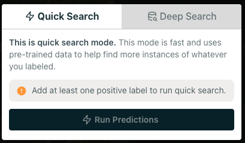

- **Quick Search** is for a first fast exploration by marking just a few labels.
- **Deep Search** is for refining the search with many more labels.

### Toolbox

  
  
  
  
  

- **Arrow**: marks individual tiles.
- **Brush**: marks several tiles at once.
- **Eraser**: removes labels.
- **Thumbs up / Thumbs down**: defines whether the tile you mark is positive or negative.

### Map Layers

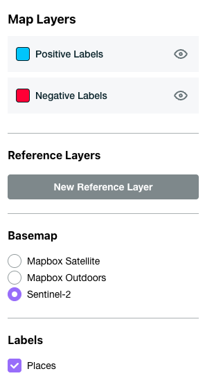

- Allow you to show or hide different layers (Positive, Negative, Predictions, etc).
- Allows you to switch the **basemap** between **Mapbox Satellite**, **Mapbox Outdoors**, and **Sentinel-2**.

### Coordinates

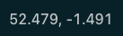

- Click the coordinates at the bottom of the screen, to manually go to a specific location.

## Case 1: Let's look for some airports!

- Before starting, make sure **Mapbox Satellite** is selected in **Map Layers**. This will let us work with high-resolution imagery.
- Zoom in until you can clearly see the tiles.

### 1. Choose your airport

The model needs a reference point to start from. Choose the airport you want and go to any of these coordinates:

- **Heathrow**: `51.475, -0.461`
   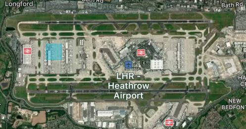
- **Birmingham**: `52.458, -1.742`
   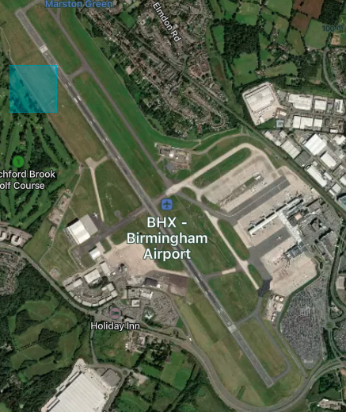
- **Gatwick**: `51.151, -0.186`
   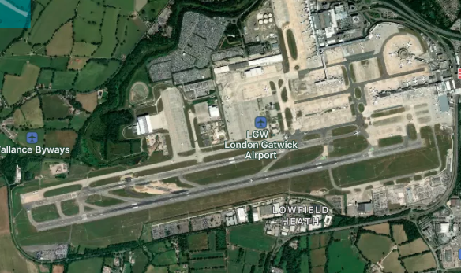

### 2. Mark a few first positive labels

- In the **Toolbox**, select **Arrow**.
- Activate **Positive** labels.
- Mark **2, 3, or 4 tiles** on a runway. Do not use too many.
- The labels should appear light blue. If you make a mistake, you can use the **Eraser** to remove one or more labels.
- Once you're ready, go to the **Quick Search** panel and click **Run Predictions**. The results will appear immediately!

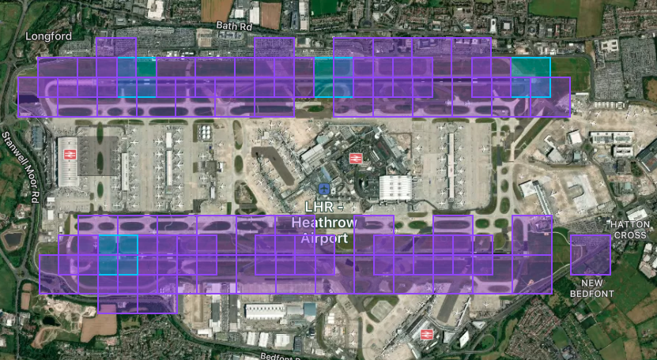

### 3.Analyzing the predictions

- You will not get exactly the same results as someone else, because small changes in the initial tiles can change the outcome.
- Use the **confidence filter** to select which results you want to show on the map.
- Zoom out and explore the map to see the predictions in different locations

#### ¿What happened here?

(This may be different in your own search!)

True positives:

- **Stansted**: `51.884, -0.242`
- **Luton**: `51.876, -0.371`

False negative:

- **Gatwick**: `51.147, -0.188`

False positives:

- **Anglesey circuit**: `53.189, -4.497`
- **Former Royal Air Force Honiley**: `52.357, -1.665`
- **HORIBA MIRA test site**: `52.563, -1.448`
- **Mallory Park racing circuit**: `52.601, -1.333`

## Going deeper with Deep Search

**Deep Search** is used to improve results after the initial exploration. Here we will mark many more labels, both **positive** and **negative**, to refine the search and get better resultas. You should use it once you already identified several correct results and several false positives.

### How to prepare it

- Add many more labels -around **30 positive** and **100 negative** for a first round.
- You can use the **Brush** to label faster.

### Run Deep Search

1. Go to **Deep Search**.
2. Leave the confidence at a **98%**.
3. **Run the search** -it will take a few minutes. The Deep Search predictions are yellow.
4. Review the results, add more labels, and iterate!
5. You'll start getting good results after +100 positive and +300 negative labels, but it really depends on each individual case.

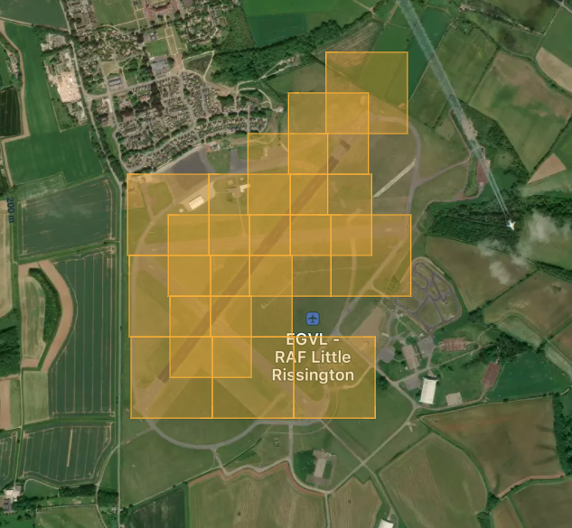

## Export results and review them in a Google Earth

Earth Index is an exploration tool, and we should always manually audit the results. Analyzing the results in a GIS such as Google Earth or QGIS allows us to add new geospatial analysis layers, view historical imagery, use higher resolution images and much more.

1. Go to the **Labels** panel.
2. Open the **three-dot menu**.
3. Choose **Export GeoJSON**.

### Open the file in Google Earth

- Open **Google Earth**
- Drag and drop the exported file into **My Places**
- Use the time slider to review historical changes.

### Style the results by type

Earth Index exports **positive**, **negative**, and **prediction** results together. In Google Earth, it can be useful to separate them visually:

1. Right-click the layer and open **Get Info**.
2. Go to **Style, Color**.
3. Set the **Line width** to `2`.
4. Under **Area**,  choose **Outlined** and click OK.

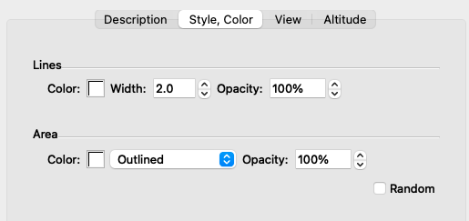

5. Go to **Edit --> Apply Style Template...** and create a new template.
6. Go to color and choose **Set color from field** and select the **Label** field.
7. Choose the pallete start and end colors you prefer to use (i.e. red and green)
8. Set the same color for **prediction** and **positive**, and another color for the **negative** labels and click on OK to finish.

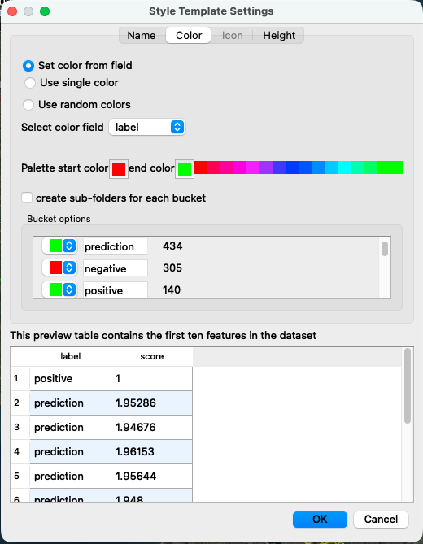

## Case 2: Looking for illegal quarries in Serbia

Now we will do the process in reverse. Instead of starting by marking tiles manually, we will upload a set of known legal quarries from official Serbian government data and use them as the starting point for the search. Then we will compare the results with a larger quarry dataset to identify locations that may be worth investigating further.

1. Create a **new project** and set the **Area of Interest** to **Serbia**.
2. In the **Map Layers** panel, click **New Reference Layer** -> **Upload**, and upload the file **`quarries-subset.geojson`**. These are some of the officially recorded quarry locations.
3. Convert that layer into positive labels by clicking the **three-dot menu** next to the layer and selecting **Convert to positive labels +**.
4. Run a **Quick Search**.

- NOTE: The usual workflow should be to mark a few examples first and then refine the search with **Deep Search**. We are doing it this way here simply to save time :)

5. Export the results and import them into **Google Earth**.
6. Also load the file **`quarries-full.geojson`** into **Google Earth**.
7. Look for places where the official quarry points and the Earth Index detections **do not match**. Those mismatches may point to possible quarry sites worth investigating as unregistered or illegal operations.

# Some final tips and recommendations

## General workflow  for EI

1. Gather a few reliable initial examples of what you want to find. Use your previous experience, find information in news articles, NGO reports, social media, etc. Mark a small number of **positive** labels and run a **Quick Search**.
2. Review the results carefully to try to understand how the tool worked. Identify any new hotspots you weren’t aware of: focus on clusters of multiple detections, but also pay attention to smaller, isolated ones, which may indicate borderline cases. **Where did it work well? Where did it fail?.**
3. Based on this initial analysis, label a few dozen **positive** and **negative** and run a **Deep Search**. Negatives are especially important because they allow you to filter out edge cases—things that look similar to what you're looking for, but aren't. Use the brush to select them all at once!If you’re unsure how to label them, switch between the different basemaps and use Google Earth to better understand what you’re seeing. When in doubt, **it’s always better not to label something than to label it incorrectly**.
4. **Iterate** a few times, adding labels until you’re satisfied with the results. Usually you'll get good results after +100 positive and +300 negative labels, but don’t overdo it: it’s impossible to detect absolutely everything, and that’s not the tool’s goal! **Usage quota is 30 DeepSearch runs per month**.
5. Export the detections and review them manually in Google Earth, QGIS, or other GIS software. You might discover things the tool missed!

## Recommendations

- **Earth Index** is an exploratory tool designed to help you map something on the ground, but you should always validate your data manually.
- Look for **ground truth** and local sources to confirm your data. Satellite images are just data—go out into the field or check with reliable sources to make sure that what you think you’re seeing is actually there. The information you gather during fieldwork will help you refine your data in the next iteration.
- A large part of the work with EI is **testing, reviewing, and trying again**. If you’re not getting good results, try different things: change the size of the area of interest, the initial labels you use, the labels you mark in the second iteration, etc. You can use different projects and combine the results.
- The model runs on **Sentinel-2** (10 meters per pixel). If you try to distinguish details that are too subtle, performance may get worse.
- Use historical imagery and other geospatial viewers to better understand the context and how the territory changed. Use **Google Earth** (high resolution, low frequency) or **Copernicus browser** (medium resolution, high frequency) to review historical images.
- Use additional geospatial layers find new clues: concessions, protected areas, indigenous territories, Open Source Map data, etc. You can also use geospatial data as a starting point for Earth Index.
